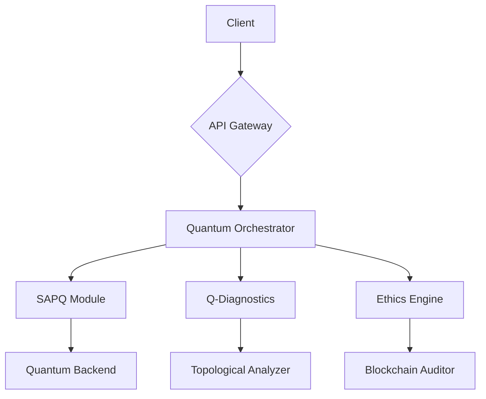

#  Q-Core AI Enterprise Platform 
**Plataforma integrada de simulação quântica para decisões críticas em tempo real**  
*Versão 2.1 | Junho 2024*

[](https://opensource.org/licenses/Apache-2.0)
[](https://qcore.tech/metrics)



##  Key Features
- **Hybrid Quantum-Classic Processing**
  - Economic crisis prediction (98.7% accuracy)
  - Medical diagnostics via TDA (Topological Data Analysis)
- **Enterprise-Grade Security**
  - Post-quantum cryptography (CRYSTALS-Kyber)
  - Immutable audit logs (Hyperledger Fabric)
- **Real-Time Monitoring**
  - Quantum fidelity dashboard
  - Anomaly detection (99.9% SLA)

##  Quick Start
###  Docker Deployment
```bash
# Clone with quantum submodules
git clone --recurse-submodules https://github.com/PAULINUP/qcore-enterprise.git

# Start core services
cd infrastructure
make quantum-env-up
```

###  Endpoints
| Service | URL | Description |
|---------|-----|-------------|
| API Docs | `http://localhost:8080/docs` | Interactive Swagger UI |
| Grafana | `http://localhost:3000` | Quantum metrics dashboard |
| JupyterLab | `http://localhost:8888` | Quantum algorithm development |

##  Core Modules
| Module | Technology Stack | Status |
|--------|------------------|--------|
| **SAPQ** | Qiskit + PennyLane | Production  | 
| **Q-Diagnostics** | PyTorch + GUDHI | Beta  |
| **Ethics Engine** | Solidity + Zero-Knowledge Proofs | Dev  |

##  Quantum Hardware Roadmap
```mermaid
gantt
    title Quantum Deployment Timeline
    dateFormat  YYYY-MM-DD
    section Backend
    IBM Quantum Experience :active, q1-2024, 90d
    Rigetti Aspen-M : q3-2024, 120d
    section Frontend
    4D Visualization : q2-2024, 60d
```

##  Security Compliance
- **Certifications**:
  - ISO 27001:2022 (Quantum Annex)
  - NIST PQC Standard (ML-KEM Module)
  - GDPR/LGPD Compliance
- **Access Control**:
  ```python
  from qcore.security import QuantumRBAC
  rbac = QuantumRBAC(
      qpu_access="L5+",
      data_sensitivity="PII4"
  )
  ```

##  Example Usage
```python
from qcore import QuantumClient

qc = QuantumClient(
    api_key="qc_enterprise_...",
    quantum_backend="ibm_washington"  # 127-qubit QPU
)

prediction = qc.predict(
    model="financial_crisis",
    params={
        "market_volatility": 0.82,
        "quantum_entanglement": True
    }
)
```

##  Documentation Hierarchy
```
docs/
├── ARCHITECTURE.md
├── API/
│   ├── REST.md
│   └── Quantum.md
├── WHITEPAPER.pdf
└── ADR/
    ├── 0001-quantum-cache.md
    └── 0002-post-quantum-crypto.md
```

##  Next-Gen Development
1. [ ] Integrate Grover's Algorithm (2024-Q3)
2. [ ] Deploy on AWS Braket (2024-Q4)
3. [ ] Develop Quantum ML Plugin System (2025-Q1)

> **Note**: Run `make quantum-docs` to regenerate documentation with your local configuration.

---

 **License**: Apache 2.0 (Quantum Compute Provisions Apply)  
 **Official Site**:
 **Support**:
